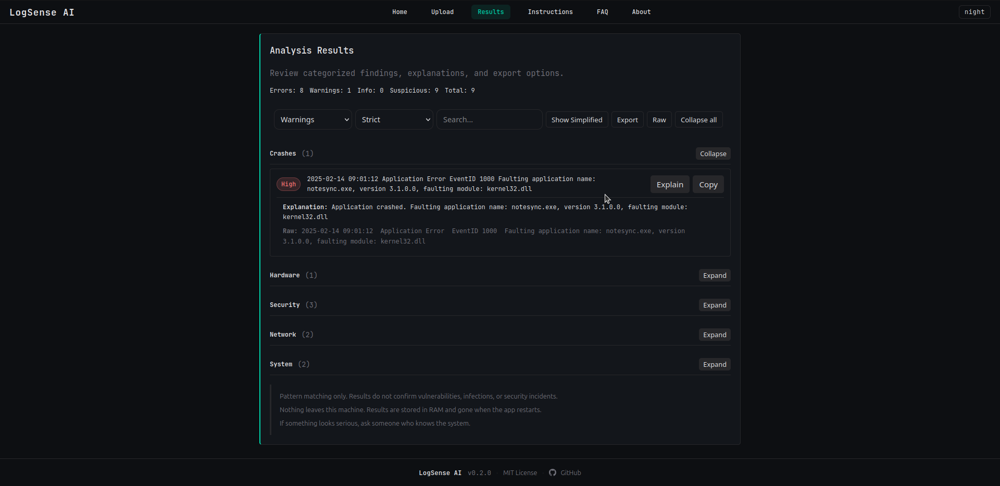
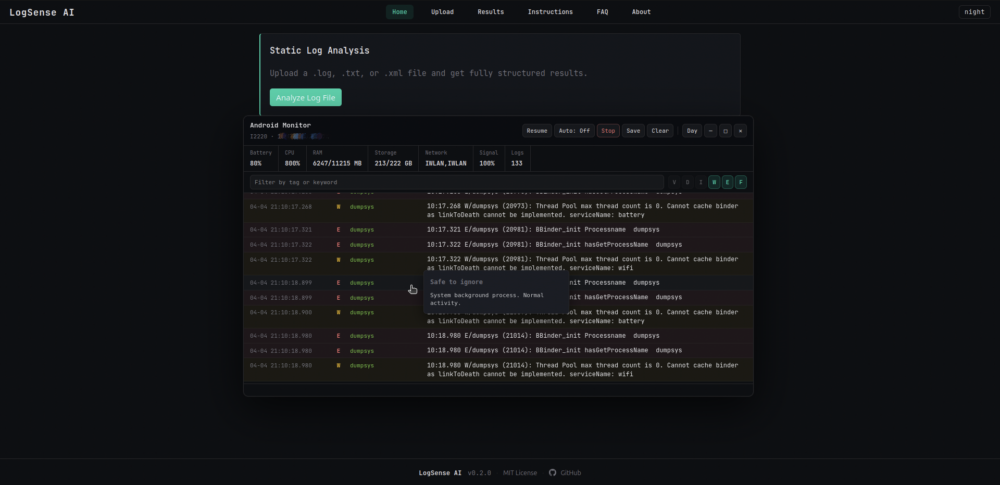
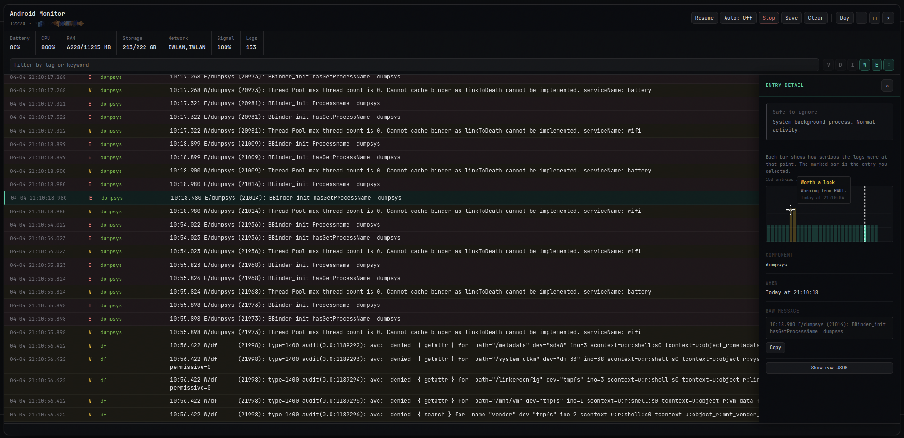

# LogSense AI

Local log analysis and live Android monitoring. No cloud, no API calls, no accounts.

The **AI** in the name refers to rule-based triage and pattern inference, not a language model.







## What it does

- Parses `.log`, `.txt`, `.xml`, and `.evtx` files up to 64MB
- Reads Windows `.evtx` binary files directly, maps Security, System, Sysmon, Defender, AppLocker, PowerShell, RDP, and BitLocker events
- Severity classification with pattern matching and confidence scoring
- Adjustable threshold: Strict, Normal, Relaxed
- Live Android logcat monitoring via ADB
- Real-time triage with hover summaries and detail inspector
- Session activity chart in the inspector panel
- Export as TXT, CSV, or JSON
- Dark and light mode, fully offline

## Setup

**Linux and macOS**

```bash
git clone https://github.com/gaisma22/LogSense-AI.git
cd LogSense-AI
python -m venv venv
source venv/bin/activate
pip install -r requirements.txt
python app.py
```

**Windows** - use Command Prompt, not PowerShell

```
git clone https://github.com/gaisma22/LogSense-AI.git
cd LogSense-AI
python -m venv venv
venv\Scripts\activate
pip install -r requirements.txt
python app.py
```

## Android monitoring

Install ADB:
- Linux: `sudo apt install adb`
- macOS: `brew install android-platform-tools`
- Windows: download Platform Tools from the Android developer site and add to PATH

Enable USB debugging, connect via USB, tap Allow when prompted, then click Check Device on the home page.

## License

MIT
